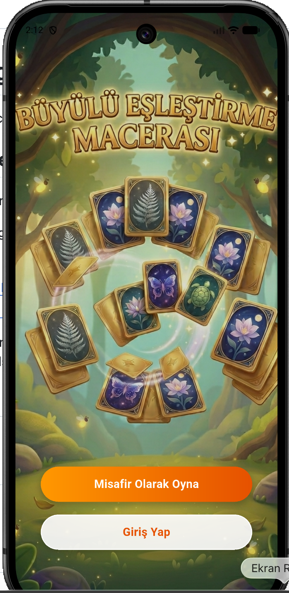
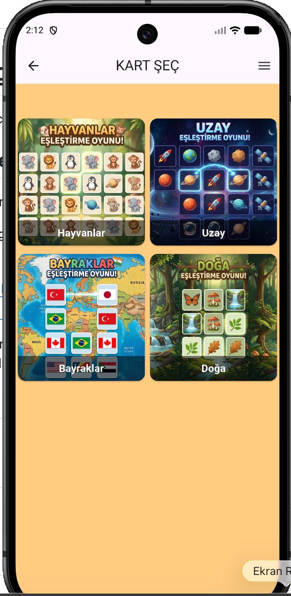
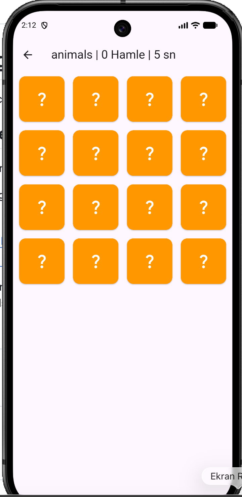
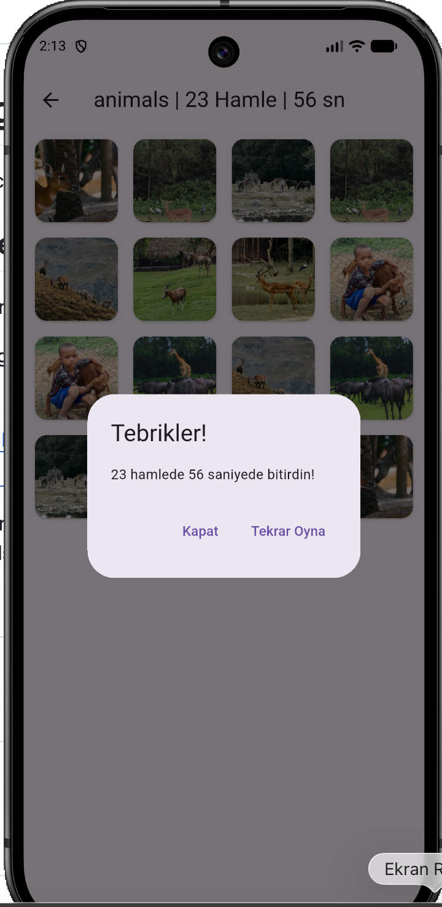

# 🃏 Büyülü Eşleştirme Macerası (Memory Game)

Flutter ile geliştirilmiş, kategorili kart eşleştirme oyunu. Firebase Authentication ile kullanıcı girişi, Pexels API ile dinamik görsel çekme özellikli bir mobil uygulama.

[English version below ⬇️](#-magical-matching-adventure-memory-game)

---

## 🇹🇷 Türkçe

### 📱 Hakkında

Bu proje, mobil uygulama geliştirme öğrenme sürecimde geliştirdiğim bir kart eşleştirme (hafıza) oyunudur. Kullanıcılar farklı kategoriler arasından seçim yapıp (Hayvanlar, Uzay, Bayraklar, Doğa) eğlenceli bir hafıza oyunu oynayabilirler.

### ✨ Özellikler

- 🔐 **Firebase Authentication** ile kayıt ol / giriş yap
- 👤 **Misafir olarak oynama** seçeneği
- 🎴 **4 farklı kategori**: Hayvanlar, Uzay, Bayraklar, Doğa
- 🌐 **Pexels API** entegrasyonu ile dinamik, her oyunda farklı görseller
- ⏱️ **Süre sayacı** ve **hamle sayacı**
- 🎉 Oyun bitince tebrikler ekranı ve "Tekrar Oyna" seçeneği
- 🎨 Özel tasarlanmış, tema uyumlu arayüz

### 🛠️ Kullanılan Teknolojiler

- **Flutter & Dart** — Mobil uygulama geliştirme
- **Firebase Authentication** — Kullanıcı yönetimi
- **Pexels API** — Görsel çekme
- **http** paketi — API istekleri

### 🚀 Kurulum

```bash
git clone https://github.com/berfinkkarakoc/memory_game.git
cd memory_game
flutter pub get
```

Kendi Pexels API key'inizi almak için [pexels.com/api](https://www.pexels.com/api/) adresinden ücretsiz kayıt olun, ardından `lib/services/api_keys.dart` dosyası oluşturup şunu ekleyin:

```dart
const String pexelsApiKey = "API_KEYİNİZ";
```

Firebase için kendi projenizi oluşturup `flutterfire configure` komutuyla bağlayın.

```bash
flutter run
```

### 📸 Ekran Görüntüleri
| Giriş Ekranı | Kategori Seçimi | Oyun Ekranı | Tebrikler |
|:---:|:---:|:---:|:---:|
|  |  |  |  |

### 📝 Notlar

Bu proje kişisel öğrenme amaçlı geliştirilmiştir. Geliştirme sürecinde Flutter ve Firebase'i öğrenirken adım adım inşa edilmiştir.

---

## 🇬🇧 English

# 🃏 Magical Matching Adventure (Memory Game)

A category-based card matching game built with Flutter. Features Firebase Authentication for user login and the Pexels API for dynamic image fetching.

### 📱 About

This project is a memory matching game I developed during my mobile app development learning journey. Users can choose between different categories (Animals, Space, Flags, Nature) and play a fun memory game.

### ✨ Features

- 🔐 **Firebase Authentication** for sign up / login
- 👤 **Guest play** option
- 🎴 **4 different categories**: Animals, Space, Flags, Nature
- 🌐 **Pexels API** integration for dynamic images, different every game
- ⏱️ **Timer** and **move counter**
- 🎉 Congratulations screen with "Play Again" option upon completion
- 🎨 Custom-designed, theme-matched UI

### 🛠️ Tech Stack

- **Flutter & Dart** — Mobile app development
- **Firebase Authentication** — User management
- **Pexels API** — Image fetching
- **http** package — API requests

### 🚀 Getting Started

```bash
git clone https://github.com/berfinkkarakoc/memory_game.git
cd memory_game
flutter pub get
```

To get your own Pexels API key, sign up for free at [pexels.com/api](https://www.pexels.com/api/), then create a `lib/services/api_keys.dart` file with:

```dart
const String pexelsApiKey = "YOUR_API_KEY";
```

For Firebase, create your own project and connect it using `flutterfire configure`.

```bash
flutter run
```

### 📸 Screenshots

| Login Screen | Category Selection | Game Screen | Congratulations |
|:---:|:---:|:---:|:---:|
|  |  |  |  |
### 📝 Notes

This project was built for personal learning purposes, developed step by step while learning Flutter and Firebase.

---

### 👩‍💻 Geliştirici / Developer

**Berfin Karakoç**
